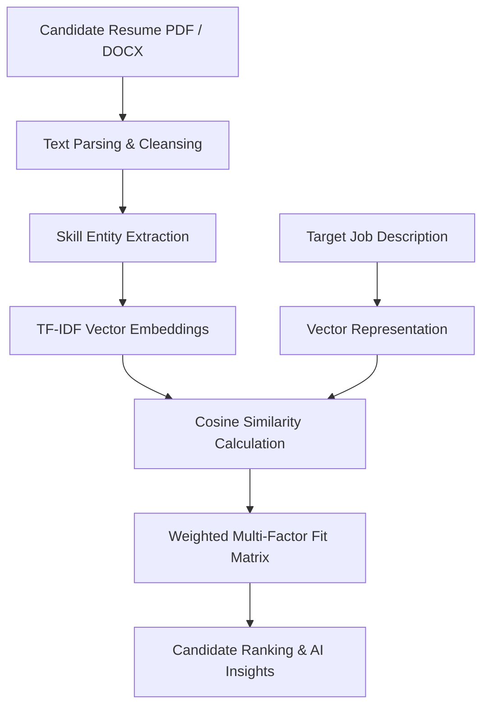

# ⚡ TalentPulse AI — Intelligent Resume Screening & Talent Intelligence Platform

[](https://python.org)
[](https://flask.palletsprojects.com/)
[](https://scikit-learn.org/)
[](https://sqlite.org)
[](https://docker.com)

TalentPulse AI is a production-ready, enterprise-grade AI Resume Screening and Candidate Ranking platform. Powered by **TF-IDF Vector Cosine Similarity**, **NLP Skill Entity Taxonomy Extraction**, and **Multi-Factor Weighted Scoring**, TalentPulse AI automates high-volume candidate evaluation with speed, precision, and complete decision explainability.

---

## 🌟 Key Features & Capabilities

### 💻 1. AI Job Description Workbench & Generator
- **AI JD Generator**: Type any job title (e.g. *MERN Stack Developer*) and click `🤖 Generate with AI` to auto-generate responsibilities, skill taxonomy, and market salary benchmarks.
- **Job Description Quality Audit**: Instant 100-point quality score evaluating skill clarity, title accuracy, and benefits.
- **Bias-Free Language Audit**: 97% bias-free check ensuring inclusive language across job postings.
- **"What-If" Requirement Simulator**: Live interactive slider allowing recruiters to adjust experience weights and watch candidate rankings recalculate in real-time.

### 📄 2. Resume Parsing & Batch Screening
- **Multi-Format Extraction**: Parses `.pdf`, `.docx`, and `.txt` candidate resume documents.
- **Configurable Screening Filters**: Set minimum match score thresholds (60%, 75%, 85%) and minimum experience year filters (including 0-year Fresher / Entry Level).
- **Duplicate Detection**: Real-time duplicate file checking to prevent duplicate applications.

### 📱 3. Sliding Candidate Profile Drawer
- **Zero Page-Reload Deep Dive**: Click any candidate row in the ranking matrix to slide open a detailed candidate drawer without leaving the page.
- **Interactive Radar Profile**: Chart.js radar visualization mapping *Similarity*, *Skill Match*, *Experience*, and *Education*.
- **AI Explainability**: Transparent breakdown of matched vs. missing skills (`✔ Matched: React`, `✖ Missing: AWS`).
- **AI Technical Question Generator**: Tailors technical interview questions specifically to the candidate's resume skills.

### 📊 4. Interactive Hiring Pipeline & Analytics
- **Kanban Board**: Drag & drop candidates between recruitment stages (*Applied*, *Shortlisted*, *Interview*, *Rejected*) with instant status persistence.
- **Head-to-Head Candidate Compare**: Compare two candidate profiles side-by-side to declare an AI Recommended Winner with confidence ratings.
- **Real-Time Notification Bell**: Unread live dropdown notifications for resume uploads and interview schedules.
- **Multi-Format Data Exports**: Export ranking matrix data directly to **CSV** or **JSON**.

---

## 🏗️ System Architecture & ML Pipeline



### Multi-Factor Weighted Scoring Formula
$$\text{Overall Fit Score} = (0.40 \times \text{Semantic Similarity}) + (0.30 \times \text{Skill Match}) + (0.20 \times \text{Experience Fit}) + (0.10 \times \text{Education Alignment})$$

---

## 🛠️ Technology Stack

- **Backend Framework**: Python 3.11, Flask 3.0, Flask-SQLAlchemy, SQLAlchemy 2.0
- **Machine Learning & NLP**: Scikit-Learn (TF-IDF Vectorizer), NumPy, Pandas
- **Document Extractors**: PyPDF, python-docx, ReportLab
- **Frontend & UI**: HTML5, Vanilla CSS3 (Glassmorphism design tokens), JavaScript (ES6+), Chart.js
- **Database**: SQLite (Development) / PostgreSQL (Production)
- **Deployment & WSGI**: Gunicorn, Docker, Docker Compose, Render / Railway / Heroku

---

## Glimpse


## 🚀 Quick Start & Installation

### Prerequisites
- Python 3.10+
- Git

### 1. Clone Repository & Setup Virtual Environment
```bash
git clone https://github.com/your-username/TalentPulse-AI.git
cd TalentPulse-AI

# Create virtual environment
python -m venv venv

# Activate virtual environment
# Windows:
venv\Scripts\activate
# macOS/Linux:
source venv/bin/activate
```

### 2. Install Dependencies
```bash
pip install -r requirements.txt
```

### 3. Run Application
```bash
python app.py
```
Open your browser and navigate to **`http://127.0.0.1:5000`**.

---

## 🐳 Docker Container Deployment

Run the complete application inside a Docker container:

```bash
docker-compose up --build
```

The application will be live at `http://localhost:5000`.

---

## 🔒 Security & Best Practices

For web application security, users and administrators should adhere to standard industry practices such as OWASP guidelines, input sanitization, environment variable secrets management, and HTTPS deployment.

---


